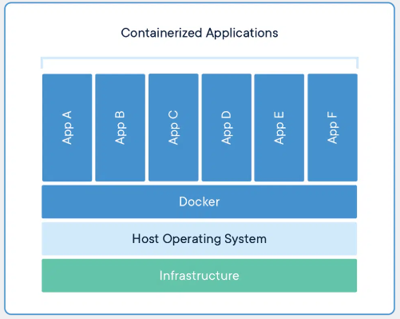

# Docker

## Isolando Ambientes de Testes

### O que é Docker e por que ele é importante

[Docker](https://www.docker.com/) é uma plataforma de **containerização** que utiliza virtualização a nível de sistema operacional para empacotar e entregar aplicações em unidades chamadas **contêineres**. Esses contêineres são isolados entre si, incluindo todos os softwares, bibliotecas e arquivos de configuração necessários para que uma aplicação funcione corretamente.

O Docker facilita a criação de **imagens** de aplicativos, que podem ser usadas localmente ou em orquestradores como **Kubernetes** para execução em larga escala.

---

## Conceitos Básicos: Imagens e Contêineres

### **Imagem**
Uma **imagem Docker** é um pacote imutável que contém o sistema de arquivos e as dependências necessárias para criar um contêiner. Ela é composta por várias camadas que representam as diferentes partes do sistema de arquivos do contêiner, incluindo:

- **Sistema Operacional**: A base do sistema (ex: Ubuntu, Alpine).
- **Arquivos da Aplicação**: O código-fonte ou binários da aplicação.
- **Dependências**: Bibliotecas e ferramentas necessárias para a aplicação funcionar.
- **Configurações**: Arquivos de configuração e variáveis de ambiente.

As imagens podem ser armazenadas em repositórios como o [Docker Hub](https://hub.docker.com/) para facilitar o compartilhamento e a reutilização.

### **Contêiner**
Um **contêiner Docker** é uma instância em execução de uma imagem. Ele é um ambiente isolado e autossuficiente que executa a aplicação contida na imagem, incluindo código, dependências, configurações e bibliotecas do sistema.

---

## Arquitetura do Docker

A arquitetura do Docker é baseada em um modelo cliente-servidor, composto por três componentes principais:

1. **Docker Client (Cliente Docker)**:
   - A interface de linha de comando onde os comandos Docker são executados (ex: `docker run`, `docker build`). O cliente interage com o **Docker Daemon** para realizar operações.

2. **Docker Daemon (Demon)**:
   - O processo que executa e gerencia os contêineres no sistema. Ele lida com a criação, execução e monitoramento dos contêineres, além de se comunicar com o Docker Registry para armazenar ou baixar imagens.

3. **Docker Registry (Repositório Docker)**:
   - Um repositório onde as imagens Docker são armazenadas. O Docker Hub é o registro público mais popular, mas também é possível configurar registros privados para armazenar imagens internamente.

---

## Instalação

Siga as instruções abaixo para instalar o Docker conforme seu sistema operacional:

- [Instalação no MAC ou WINDOWS](./install/mac-win.md)
  - O **Docker Desktop** é uma ferramenta específica para Windows e macOS, projetada para facilitar a instalação e o gerenciamento do Docker nessas plataformas, que não possuem suporte nativo a contêineres Linux.
  
- [Instalação no WSL](./install/wsl.md)
  - Para usuários do Windows Subsystem for Linux, é possível instalar o Docker diretamente no WSL para uma experiência mais próxima de um ambiente Linux.

- [Instalação no LINUX](./install/linux.md)
  - No Linux, o Docker pode ser instalado diretamente a partir dos repositórios oficiais, e ferramentas como o **Docker Compose** podem ser utilizadas para gerenciar contêineres multi-container.

---

## Comandos Essenciais do Docker

Abaixo estão alguns dos comandos mais utilizados para criar, gerenciar e remover contêineres:

- **[docker run](./comandos/run.md)**: Cria e executa um novo contêiner a partir de uma imagem.
- **[docker exec](./comandos/exec.md)**: Executa um comando dentro de um contêiner em execução.
- **[docker ps](./comandos/ps.md)**: Lista os contêineres em execução.
- **[docker tag](./comandos/tag.md)**: Cria uma nova tag para uma imagem.
- **[docker build](./comandos/build.md)**: Construa uma imagem a partir de um Dockerfile.
- **[docker pull](./comandos/pull.md)**: Faz o download de uma imagem de um registro (ex: Docker Hub).
- **[docker push](./comandos/push.md)**: Envia uma imagem para um Docker Registry (ex: Docker Hub).
- **[docker images](./comandos/images.md)**: Lista as imagens armazenadas localmente.
- **[docker login](./comandos/login.md)**: Faz login no Docker Registry (ex: Docker Hub).
- **[docker logout](./comandos/logout.md)**: Faz logout do Docker Registry.
- **[docker search](./comandos/search.md)**: Pesquisa por imagens no Docker Hub.
- **[docker version](./comandos/versao.md)**: Verifica a versão do Docker instalada.
- **[docker info](./comandos/info.md)**: Exibe informações detalhadas sobre o sistema Docker.
- **[Dockerfile](./comandos/criar-dockerfile.md)**: Como criar um Dockerfile para definir o ambiente de uma imagem.
- **[docker rm](./comandos/rm.md)**: Remove um contêiner.
- **[docker rmi](./comandos/rmi.md)**: Remove uma imagem.
- **[docker stop](./comandos/stop.md)**: Para a execução de um contêiner.

---

## Recomendações

- Para melhorar a experiência de desenvolvimento, instale a extensão **Docker** no **VSCode**. Ela oferece recursos como gerenciamento visual de contêineres, imagens e redes diretamente no editor.

---

## Projetos

Aqui estão alguns exemplos de projetos para você testar e aprender mais sobre o uso de Docker:

- [NGINX](./projetos/nginx/nginx.md)
- [POSTGRESQL](./projetos/postgresql/postgres.md)
- [CYPRESS](./projetos/cypress/README.md)
- [ROBOT](./projetos/robot/README.md)
- [SELENIUM](./projetos/selenium/README.md)
- [PLAYWRIGHT](./projetos/playwrite/README.md)

